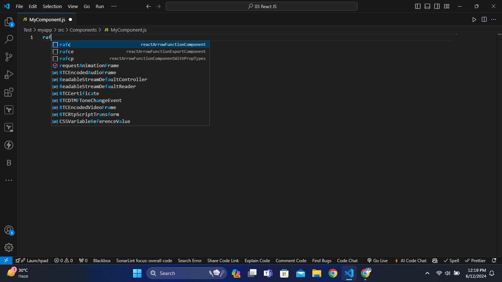
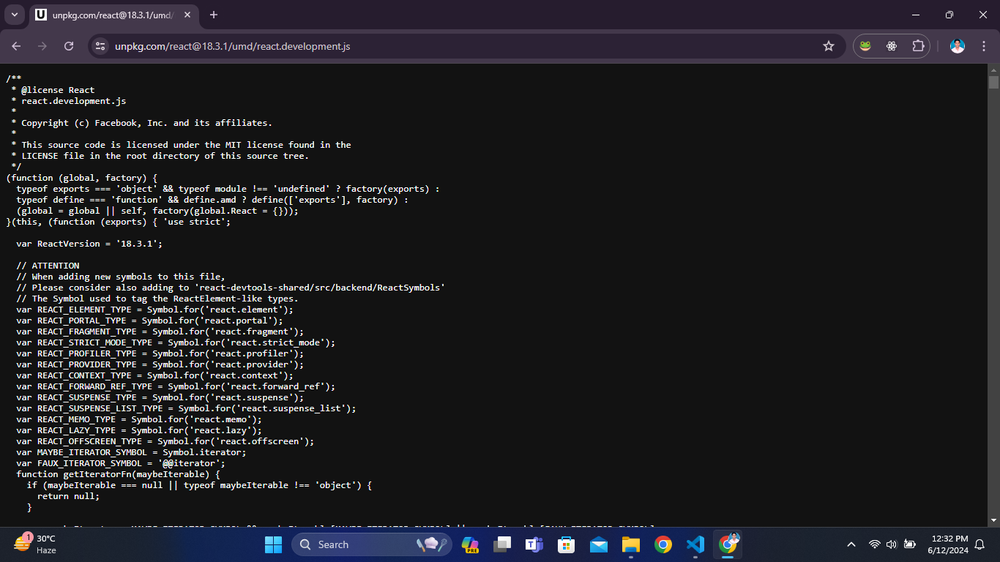
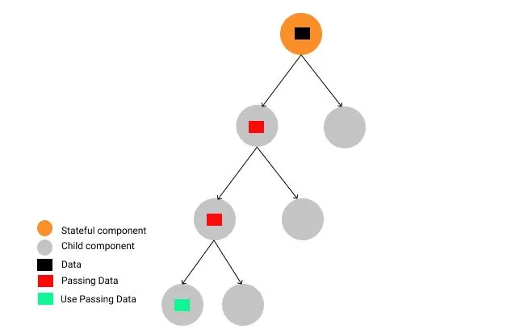
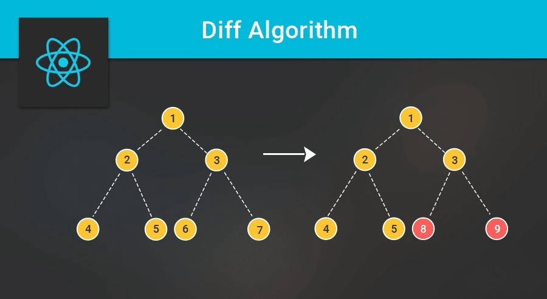

# ReactJS

<details>
<summary>Index</summary>

## Index

- General
- Introduction
- ReactApp Setup with CDN
- JSX
- Custom ReactApp Setup
- Ready Made ReactApp Setup
- React Component
- State
- props
- Component Life Cycle
- Hooks
- Routing
- Context
- Redux Toolkit
- Styles
- API
- Lazy Loading
- DOM
- React Events
- Forms
- Conditional Rendering
- Authentication & Authorization
- Industry Standards
- Optimization

</details>

---

<details>
<summary>General</summary>

## General

### Emmet

- Emmet is a tool that helps developers write and edit code faster.
- It provides shortcuts that expand into full blocks of code with a simple command.
- Show the Suggestions: **ctrl + spacebar**
  

### Chrome Shortcuts :

`ctrl + shift + j => open console `
`F12 => close console`

</details>

---

<details>
<summary>Introduction</summary>

## Introduction

### ReactJS

- **ReactJS** is an open-source JavaScript library. It was developed by Facebook.
- React code written by Facebook developers, and maintained by Facebook.
- React is used to building **User Interfaces**.
- we can create **Single Page Applications (SPA)** by using ReactJS.
- React allows us to create **Reusable components** and **Composable Components**.
- React at the end of the day is just Javascript.

### Advantages of ReactJS

- Open Source
- Easy to Learn
- Large Community
- SPA Applications
- Reusable & Composable components
- Virtual DOM

### React Version

- Now I am using latest version.
- `react@18.2.0`

### How can you confirm React is a Javascript Library?

- React Code is written in Javascript.
- React CDN code is plain JavaScript, so ReactJS is a JavaScript library.
- This is React CDN code -> You can observe the entire code in JS.
  

</details>

---

<details>
<summary>ReactApp Setup with CDN</summary>

## ReactApp Setup with CDN

### Running Javascript in HTML

- We can run JavaScript in HTML using the HTML `<script>` element. It is used to include JavaScript in HTML.
- Here the **type** attribute specifies the type of the `<script>`.

```html
<!DOCTYPE html>
<html>
  <head>
    <title>My Web Page</title>
  </head>
  <body>
    <div id="root"></div>

    <!-- JS Code -->
    <script type="text/javascript">
      const rootElement = document.getElementById("root");

      const element = document.createElement("h1");
      element.textContent = "Hello World!";
      element.classList.add("greeting");
      console.log(element);

      rootElement.appendChild(element);
    </script>
  </body>
</html>
```

### Running External Javascript in HTML

- To include an external JavaScript file in HTML, we can use the HTML `<script>` element with the attribute `src`.
- The **src** attribute specifies the path of an external JS file.

```html index.html
<!DOCTYPE html>
<html>
  <head>
    <title>My Web Page</title>
  </head>
  <body>
    <div id="root"></div>

    <!--JS Code-->
    <script type="text/javascript" src="./index.js"></script>
  </body>
</html>
```

```js index.js
const rootElement = document.getElementById("root");

const element = document.createElement("h1");
element.textContent = "Hello World!";
element.classList.add("greeting");
console.log(element);

rootElement.appendChild(element);
```

### ReactJS with CDN

**CDN** stands for **Content Delivery Network**

- React CDN code is plain JavaScript, so ReactJS is a JavaScript library.
- With React CDNs, browsers understand ReactJS.

```html
<!--CDN Links-->

<!--React-->
<script
  crossorigin
  src="https://unpkg.com/react@18/umd/react.development.js"
></script>

<!--ReactDOM-->
<script
  crossorigin
  src="https://unpkg.com/react-dom@18/umd/react-dom.development.js"
></script>
```

- Now we can Write ReactJS code in external `JS` file.

### Why two CDN files?

- React not only works on browsers, it also works on mobile phones as **React Native**.
- React works on different places.

### React Element

- `React.createElement()` method used to create an element using ReactJS.
- It is similar to the `document.createElement()` method in regular Javascript.
- Syntax : `React.createElement(type, {attributes}, children)`
- type => tag names => `h1`, `div`
- attributes => `className`, `onClick`, `id`
- children => `"Hello World"`, `<h1>Hello Universe</h1>`
- attributes and children are optional.

```js
// Heading Element
const Heading = React.createElement(
  "h1",
  { className: "greeting" },
  "Hello World"
);
```

### ReactDOM

- **ReactDOM** connects React to the RealDOM.
- **ReactDOM** is used to React interact with the Real DOM.
- `ReactDOM.render()` displays a React element.
- Syntax : `ReactDOM.render(reactElement, container); `

reactElement => What to render
container => where to render


#### Example

```js
/*
// html code

<div id="root">
	<div class="parent">
		<div class="child">
			<h1 class="greeting">Hello World!</h1>
			<h1 class="greeting">Hello Universe!</h1>
		</div>
	</div>
</div>

*/

// what to render => // (type, {attributes}, children)
const heading1 = React.createElement(
  "h1",
  { className: "greeting" },
  "Hello World!"
);
const heading2 = React.createElement(
  "h1",
  { className: "greeting" },
  "Hello Universe!"
);
const child = React.createElement("div", { className: "child" }, [
  heading1,
  heading2,
]);
const parent = React.createElement("div", { className: "parent" }, child);
console.log(parent); // Object

// where to render
const rootElement = document.getElementById("root");

// Create root
const root = ReactDOM.createRoot(rootElement); // It creates the VirtualDOM

// Render
root.render(parent);
```

</details>

---

<details>
<summary>JSX</summary>

## JSX

**JSX** stands for **JavaScript XML**

- ReactJS introduced a new HTML-like syntax named **JSX** to create elements. So, JSX makes developers life easier.
- JSX allows us to write HTML-like Syntax in JavaScript without any `React.createElement()` method.
- Web browsers can only read regular JS.
- Browser cannot understand JSX.
- JSX needs to be converted to the regular JS by using **Babel**.
- We can insert the **Dynamic variable** in JSX, but not in HTML.

```js
// JSX Syntax
const element = <h1 className="greeting">Hello World!</h1>;
```


### Babel

- Babel is a JavaScript transpiler.
- Babel converts JSX into Javascript functions that understand the React.
- React elements are converted into Regular JS.
- We can write a React component without using JSX also.
- Flow : JSX => React.createElement() -> Object => HTML code


```js
// BABEL CDN
<script src="https://unpkg.com/@babel/standalone/babel.min.js"></script>
```

```js
// Without JSX
const Heading = React.createElement(
  "h1",
  { className: "greeting" },
  "Hello World!"
);
```

```js
// With JSX
const Heading = <h1 className="greeting">Hello World!</h1>;
```

### JS Code in JSX

we can use curly braces `{}` to write any JS code inside **JSX**.

```js
{
  /* Single line JSX Comment*/
}

{
  /* 
Multiline JSX Comment
Multiline JSX Comment
*/
}

const number = 27;
const calculation = <h1>{100 + 200}</h1>;
const dynamicVariable = <h1>{number}</h1>;
const templateLiteral = <h1>{`My age is ${number}`}</h1>;
```

### React Fragment

- **Fragment** is used to return multiple elements from a React component.
- **Fragment** is used to group a list of children without adding extra node to the DOM.
- The **Fragment** is an alternate way to return a single JSX element.
- `<></>` is the shorthand tag for `React.Fragment`.
- The only difference between `<React.Fragment></React.Fragment>` and `<></>` is that the `<></>` does not support the `key` attribute.


```js
return (
  <React.Fragment>
    <Header />
    <Body />
    <Footer />
  </React.Fragment>
);
```

```js
return (
  <>
    <Header />
    <Body />
    <Footer />
  </>
);
```

```js
return(
<>
    <Header/>
    <>
        <SideBar>
        <Body/>
    </>
    <Footer/>
</>
)
```

</details>

---

<details>
<summary>Custom ReactApp Setup</summary>

## Custom ReactApp Setup

### npm

- `npm` is a packages' manager.
- Generally we can say **node package manager**, but it has no abbreviation.
- npm is a standard central repository for all the node packages.
- we can easily install any **Node.js** package by using the `npm` command followed by the name of the package.
- Example : `npm install react`

### Local **npm**

- Local `npm` helps in managing our React project **dependencies** by creating a `package.json` file.
- This `package.json` file contains information about our project and the specific packages it depends on.
- It keeps track of the package versions used in our project.
- we use **Local npm** because we want a lot of packages in our ReactApp.
- `npm` simplifies the process of installing and managing packages in our Node.js projects.

### ReactApp Setup

1. Local `npm` setup
   - `npm init` : This command allows you to provide your own configuration for create `package.json` file.
   - `npm init -y` : This command automatically creates the `package.json` file with default settings, skipping the custom configuration.
2. `package.json`
   - This file is mandatory for every project.
   - It is automatically created after `npm` setup.
   - It is used to manage information about the ReactApp, such as its name, version, dependencies, and more.
3. install `DevDependencies`
   - DevDependencies are dependencies required for development purposes only.
   - `DevDependencies` should contain modules/packages a developer needs during development.
   - These packages are necessary only while you are developing your project, not necessary on production.
   - such as, `parcel, webpack, vite`.
   - Example : `npm install -D parcel`
4. install `Dependencies`
   - Dependencies are the normal dependencies required for the ReactApp to work.
   - `npm install react`
   - `npm install react-dom`
5. `package-lock.json`
   - It is automatically created after dependencies installation.
   - It maintains the exact versions of dependencies.
   - It also keeps track of all the exact versions of the dependencies used in the ReactApp.
6. commands
   - The `npm install` command is used to recreate the node_modules directory.
   - It reads the `package.json` file and installs all the required packages mentioned in the file.

### Versions

In the `package.json` file, the ~ and ^ symbols are used to define the version ranges for the packages installed.

**~** or **^** in `package.json` file :

- The tilde (~) operator updates you to all future patch versions within the same minor version. It won't increment the minor version but allows for updates within that minor version.
- The caret (^) operator updates you to all future minor and patch versions, without incrementing the major version.

For example in `package.json` file:

```js
"devDependencies": {
   "parcel": "~2.10.3" // ~ => Automatically updates to future patch versions within the same minor version, e.g., 2.10.4, but not 2.11.0
   "parcel": "^2.10.3" // ^ => Automatically updates to future minor versions within the same major version, e.g., 2.11.0, but not 3.0.0
   "parcel": "2.10.3" // ~ => No Automatically updates.

}
```

### npx

- npm is a **node package executor**.
- `npx` is a tool that comes with `npm`, when you installed npm above 5.2.0 version then automatically `npx` will be installed. It is a npm package runner that can execute any package that you want from the npm.
- `npx` command is used to execute the package.
- Example : `npx parcel index.html`

### node_modules

- `node_modules` folder like a cache for the external modules that your project depends upon.
- The `npm install` command is used to recreate the node_modules directory using the `package.json` file.
- When you `npm install` them, they are downloaded from the web and copied into the node_modules folder and Nodejs is trained to look for them there when you import them(without a specific path).
- Here we can store all the superpowers.
- `Don't push node_modules`in GitHub because it contains lots of files(more than 200 MB), it will cost you memory space.
- we don't put "node_modules" into git, because our `package-lock.json` file have sufficient information to recreate node_modules.  
  `package-lock.json` file keep & maintain the versions of everything in node_modules.

### Scripts

- server start
  - we can add key for avoiding every time start server `npx parcel index.html`.
  - `"start" : "npx parcel index.html"`
  - Now we can start the server with `npm run start` or `npm start`.
- App build
  - `"build": "npx parcel build index.html"`
  - Now we can build the app with `npm run build`.
- `npx = npm run`

```js
   "scripts": {
		"start": "parcel index.html",
		"build": "parcel build index.html",
		"test": "jest"
	},
```

### stop the server

- `ctrl + c`

### .gitignore

- Anything which can be auto-generated should be put inside `.gitignore file`.
- The `.gitignore file` is a text file that tells `Git` which files or folders to `ignore` in a project during commit to the repository.
- For example, For security, the security key files and API keys should get added to the `.gitignore`.

The entries in this `.gitignore` file can also follow a matching pattern.

```bash
# is used to add comments to a .gitignore file

* is used as a wildcard match
/ is used to ignore pathnames relative to the .gitignore file
```

```bash
# Ignore node_modules folder
node_modules

# Ignore all text files
*.txt

# Ignore .env file
.env

```

### package-lock.json

- `package-lock.json` is a file that helps future developers and automated systems to easily download and install the same dependencies as your project.
- It also allows you to switch to previous versions of the dependencies without actually saving changes to the node_modules folder.
- The `package-lock.json` file contains important information about the dependencies and their specific versions used in your project. If you modify or delete this file, it can cause problems with the dependencies when deploying your project in the production environment. It's best not to modify the package-lock.json file because **npm** automatically handles it for you to ensure the correct dependencies are installed.

### What is the `dist` folder?

we run command `npx parcel index.html` this will create a faster development version of our project & serves it on the server.  
The /dist folder contains the minified version of your source code that is used in production for web applications. It includes all the necessary files and modules that have been optimized and made as small as possible. This folder holds the final code that is ready to be deployed and used by users.  
`npx parcel build index.html` it creates a lot of things, like minify your file.

- parcel will build all the production files to the dist folder.

### What is `browserslist`?

`Browserslist` is a tool that allows specifying which browsers should be supported in your frontend app by specifying "queries" in a config file. It's used by frameworks/libraries such as React, Angular and Vue, but it's not limited to them.

### parcel

- parcel is basically a bundler.
- It is bundle our application.
- It takes all your files and bundle into one file.

### App Example

```js
import React from "react";
import ReactDOM from "react-dom";

// what to render
const parent = (
  <div class="parent">
    <div class="child">
      <h1 className="greeting">Hello World!</h1>
      <h1 className="greeting">Hello Universe!</h1>
    </div>
  </div>
);
console.log(parent); // Object

// where to render
const rootElement = document.getElementById("root");

// Create root
const root = ReactDOM.createRoot(rootElement);

// Render
// The `ReactDOM.render()` method returns only one element in render.
root.render(parent);
```

</details>

---

<details>
<summary>Ready Made ReactApp Setup</summary>

## Ready Made ReactApp Setup

Creating a real-world application involves a lot of setup because a large number of components need to be organized.

1. create-react-app
2. create-vite

### Create React Application

1. Install `Node.js` from the official website.
2. Install Create React App globally
   - `npm install -g create-react-app`
3. Create a new React project
   - `npx create-react-app myapp`
   - It generates a ready-made React application setup.
4. Navigate to the project folder
   - `cd myapp`
5. Start the development server
   - `npm start`
6. Now you can work on your React Project

### Bundler

- Bundlers are tools that help manage and combine different pieces of JavaScript code.
- To use a tool or library in our code, we need a package manager like `npm` or `yarn`.

`npm install webpack --save-dev`
`npm install parcel --save-dev`

In React, to get external functionalities, we use Bundlers.

1. Parcel
2. Webpack -> Create React App
3. Vite -> React Vite

#### Common Bundler Features

1. Local Server => It creates a Local server
2. Port Number
3. Tree Shaking
4. Minification
5. HMR (Hot Module Reload) -> File Watcher Algorithm
6. Bundling -> Dev Build
7. Error Suggestions
8. Image Optimization
9. Clearing our code
10. Caching - Faster Builds => Super Fast build algorithm
11. Compatible with older version of browser

### Tree Shaking

- `Tree shaking` is process of removing the unwanted code that we do not use while developing the application.
- Tree shaking is a dead code elimination technique that is applied when optimizing code.
- Example : We are importing a library which has a lot of functions (20 functions). then, all those 20 functions will come into your code. But in my app, I may want to use only 1 or 2 out of it.
- Here Parcel will ignore all the unused code.


### Minification

- Minification is the process of making your code and markup smaller by removing unnecessary spaces, line breaks, and other characters that are not essential for the code to run correctly. It aims to reduce the size of the files to optimize website performance and improve loading times.
- When you write code or markup for a website or a script file, you typically use indentation, line breaks, and comments to make it more readable and understandable for yourself and other developers. However, when the code gets sent over the internet to the user's browser, all of these extra characters are not necessary for the browser to understand and execute the code.


### HMR (Hot Module Reload)

- `HMR (Hot Module Replacement)` - adds, or removes modules while an application is running, without a full page reload.
- There is `File Watcher Algorithm` (Written in C++). It keeps track of all the files which are changing realtime & it tells the server to reload.


### Bundling

Take all JS files and convert into single JS file


### What is the `dist` folder?

- we run command `npx parcel index.html` this will create a faster development version of our project & serves it on the server.
- The `/dist` folder contains the minified version of your source code that is used in production for web applications. It includes all the necessary files and modules that have been optimized and made as small as possible. This folder holds the final code that is ready to be deployed and used by users.  
  `npx parcel build index.html` it creates a lot of things, minify your file. and "parcel will build all the production files to the dist folder".

</details>

---

<details>
<summary>React Component</summary>

## React Component

- A Component is a normal JS function that returns a JSX element.
- At the end of the day, any component is a JavaScript object.

```js
// Component
const Welcome = () => <h1 className="message">Hello World</h1>;
```

- Generally developers are used Component name as PascalCase.
- PascalCase is recommended for naming convention of Component.

### Call the Component

```js
// Return JSX
return (
  <div>
    {Welcome()}
    <Welcome />
    <Welcome></Welcome>
  </div>
);
```

### Call the Element

```js
const myElement = <h1>Hello World</h1>;
const number = 27;
// Return JSX
return (
  <div>
    {/* ----- React Element Calling ----- */}
    {myElement}

    {/*----- JScode in JSX-----*/}
    {number}
    <h1>{number}</h1>
    <h1>{`My age is ${number}`}</h1>
    {console.log("Hello JS Code")}
  </div>
);
```

### Export/Import

- In **ES6**, the `export` and `import` keywords are used to write JS code one file and use it in another file.
- **ES6** provides `export` a module and `import` in another module to use it.

1. Default Export/Import
   - `export default MyComponent`;
   - `import MyComponent from "./path"`;
2. Named Export/Import
   - `export const MyComponent1 = <h1>MyComponent</h1>;`
   - `import {MyComponent} from "./path";`
3. **as** import
   - `import {MyComponent as Heading} from "./path"`;
   - In `*`, it is used to import the whole module as a component and access the components inside the module.

```js
// MyComponent File
export const MyComponent1 = () => {};
export const MyComponent2 = () => {};
export const MyComponent3 = () => {};
```

```js
import * as MainComponents from "./MyComponent";

return (
    <MainComponents.MyComponent1 />
    <MainComponents.MyComponent2 />
    <MainComponents.MyComponent3 />
)

```

### We can use `Named export` and `Default export` together.

```js
export const MyComponent1 = () => {};
export const MyComponent2 = () => {};

const MyComponent = () => {};

export default MyComponent;
```

```js
import MyComponent, { MyComponent1, MyComponent2 } from "./MyComponent";
```

### Reusable Component

A Component is a piece of code that can be used in various parts of an application.

- We can write Component once and use it multiple times.
- We can use number of times of same component.

```js
// Import External Components
import Child from "./components/Child";

const Parent = () => (
  <div>
    <Child greeting="Hello" name="Praveen Ande" />
    <Child greeting="Hello" name="Brenden Eich" />
  </div>
);

// Default Export
export default Parent;
```

```js
const Child = (props) => {
  // props object Destructuring
  const { greeting, name } = props;

  // Return JSX
  return (
    <div>
      {greeting} {name}
    </div>
  );
};
```

### Composable Component

If one Component is used inside another Component. Then it is called Component Composition.

```js
import MyComponent from "./MyComponent";

return (
  <div>
    <MyComponent />
    <MyComponent />
    <MyComponent />
  </div>
);
```

### HOC

**HOC** stands for **Higher Order Component**  
A **Higher Order Component** is function that takes a component and modify some changes and returns it as a new component.

```js
import React from "react";

// Header component
const Header = () => <h1>This is a header</h1>;

// Define a higher-order component
const withRedColor = (Component) => {
  return () => (
    <div style={{ color: "red" }}>
      <Component />
    </div>
  );
};

// Usage
const RedHeader = withRedColor(Header);
```

### Pure Function

In Javascript, when functions returns same output when same input is passed is called Pure functions. It is like returning same data for same input. So in pure function output only depend on its input arguments. Pure functions does not produce any side effects as well.

```js
function Add(num1, num2) {
  return num1 + num2;
}

let output = Add(1, 2);
console.log(output); // 3
```

### Pure Component

- We know that in React we can create a component in two different ways that one is **Class component/ Stateful component** and another is **Functional component/Stateless** component.
- A React component can be considered pure if it renders the same output for the same state and props.
- Pure component does not give any side effects.
- We can convert component to pure component as below:

- For **class components** react provides `React.PureComponent` base class.
- For **Functional component** react provides `React.memo`.

### React.PureComponent

Now, by extending `PureComponent` instead of `Component`, this class benefits from the default `shouldComponentUpdate` method provided by PureComponent, which performs a shallow comparison of **props** and **state** to determine if a re-render is necessary. In this specific example, since the name state doesn't change during the changeName method, the PureClassComponent won't re-render unnecessarily.

```js
import React, { PureComponent } from "react";

class PureClassComponent extends PureComponent {
  constructor() {
    super();
    this.state = {
      name: "React JS",
    };
  }

  // Methods
  changeName = () => {
    this.setState({ name: "React JS" });
  };

  render() {
    console.log("PureClassComponent -- Render method called");

    // Return JSX
    return (
      <div>
        <p> Name is : {this.state.name} </p>
        <button onClick={this.changeName}>Change Name</button>
      </div>
    );
  }
}

export default PureClassComponent;
```

### React.memo

- `React.memo` is similar to `React.PureComponent` and it is for functional component instead of class component.
- It memoize the Component. The Component is re-created when props or state of the Components Updated.
- you can avoid re-rendering when the same props and state of the Component.
- The `memo` function is used for memoizing functional component to prevent unnecessary renders.

```js
import React, { memo } from "react";

const MyComponent = ({ name = "Default Name" }) => {
  return (
    <div>
      {console.log("MyComponent render")}
      <label>
        <b>{name}</b>
      </label>
    </div>
  );
};

export default memo(MyComponent);
```

### Types of Components

1. **Class** Component
2. **Functional** Component

#### Class Component

- We create a Component by using classes.
- If class name starts with Capital letter then only react treats as Component otherwise react treats as HTML Element.
- The component name should always be in the pascal case.
- Class Component we can call as **stateful** Component.
- A class component requires you to extend from React `Component` and create a `render` method that returns a JSX element.

```js
// The `extends` keyword is used to inherit methods and properties from the `React.Component`.
import { Component } from "react";

class App extends Component {
  // Updating
  render() {
    // Return JSX
    return <div>App Component</div>;
  }
}
```

```js
/* -----> Third Party Packages <----- */
import { Component } from "react";

/* -----> Component <----- */
class ClassComponent extends Component {
  // Initialization
  constructor(props) {
    console.log("constructor");
    super(props);
    this.state = { counter: 0 };
  }

  // Mount
  componentDidMount() {
    console.log("componentDidMount method");
  }

  // Update
  componentDidUpdate() {
    console.log("componentDidUpdate method");
  }

  // Unmount
  componentWillUnmount() {
    console.log("componentWillUnmount method");
  }

  // Methods
  handleIncrement = () => {
    console.log("---custom handleIncrement method");
    this.setState((prevState) => ({ counter: prevState.counter + 1 }));
  };

  // render
  render() {
    console.log("render method");
    // State destructuring
    const { counter } = this.state;

    // return JSX
    return (
      <div>
        <h1>I am ClassComponent</h1>
        <div>
          <span>{counter}</span>
          <button onClick={this.handleIncrement}>counter</button>
        </div>
      </div>
    );
  }
}

/* -----> Export <----- */
export default ClassComponent;
```

#### Functional Component

- A functional component is just a JavaScript function that accepts props as an argument and returns a React JSX element.
- There is no render method used in functional components.
- If component have don't have any state, then It is called Stateless component.
- React lifecycle methods `(constructor, componentDidMount, componentWillUnmount, render ...etc.)` cannot be used in functional component.

```js
const App = () => {
  // Return JSX
  return <div>App Component</div>;
};
```

```js
import React, { useState, useEffect } from "react";

const FunctionalComponent = () => {
  console.log("FunctionalComponent render");

  // State
  const [count, setCount] = useState(0);

  // Effect
  useEffect(() => {
    console.log("mount & update");

    return () => {
      console.log("unmount or before next update");
    };
  }, [count]);

  // Methods
  const handleIncrement = () => {
    console.log("handleIncrement button");
    setCount(count + 1);
  };

  return (
    <div>
      I am FunctionalComponent
      <div>
        <span>{count}</span>
        <button onClick={handleIncrement}>Count</button>
      </div>
    </div>
  );
};

export default FunctionalComponent;
```

</details>

---

<details>
<summary>State</summary>

## state

- State is created and managed within the component, similar to a variable declared within the function.
- State is used to store the component's data that changes over time.
- We can update state
  - `setState` method in class Component
  - `const[name, setName] = useState` hook in Functional Component
- when the state changes, automatically the component re-renders.
- If we try to update the state directly then it won't re-render the component.
- state should be immutable

### setState

- `setState()` method is a class component method.
- The **setState** is a method to modify the current state.
- When the state object changes, the component re-renders.

```js
// Initialization
  constructor(props){
        super(props)
        this.state = {count:0}  // When the state object changes, the component re-renders.
    }

// Methods
    onIncrement = () => {
        // updating state
        this.setState((prevState) => ({count:prevState.count+1}))  // Function as an argument
    }

    onReset = () => {
		// updating state
        this.setState( {count:0} )  // Object as an argument
    }

```

### setState() callback function

The `setState()` method is a asynchronous, it takes an optional callback parameter that can be used to make updates after the state is changed.

```js
this.setState({ key1: value1 }, callback);
```

### React Batch Updating

React combines multiple `setState()` calls into single update.

```js
import { Component } from "react";

class App extends Component {
  state = { count: 0 };

  onIncrement = () => {
    this.setState((prevState) => ({ count: prevState.count + 1 }));
    this.setState((prevState) => ({ count: prevState.count + 1 }));
    this.setState((prevState) => ({ count: prevState.count + 1 }));
  };

  // when you click on the Increase button only one time render will be triggered.

  render() {
    const { count } = this.state;
    console.log("render() called");
    return (
      <>
        <p>Count {count}</p>
        <button onClick={this.onIncrement}>Increase</button>
      </>
    );
  }
}

export default App;
```

`output : count is 3`

</details>

---

<details>
<summary>props</summary>

## props

- `Props` stands for **Properties**.
- We can pass information from **Parent Component** to **Child Component** by using props.
- props are just normal arguments.
- In functions, It is like pass arguments to a function.
- In Component, It is like pass properties to a component.
- props are used in React to pass data from one component to another (from a parent component to a child component).
- The child component accept props as parameters and can be accessed directly.
- Child Component can't change the props.
- props are immutable. A component cannot change the props.
- props are read-only.

```js
// Import External Components
import Child from "./components/Child";

const Parent = () => (
  <div>
    <Child greeting="Hello" name="Praveen Ande" />
    <Child greeting="Hello" name="Brenden Eich" />
  </div>
);

// Default Export
export default Parent;
```

```js
const Child = (props) => {
  // props object Destructuring
  const { greeting, name } = props;

  // Return JSX
  return (
    <div>
      {greeting} {name}
    </div>
  );
};

// Default Export
export default Child;
```

### Prop Drilling

- Prop Drilling is a process in which Props are passed from one Component to another Component that does not need the data but only helps in passing it through the tree.

- Example :
  We have grand, parent, and child components. In this scenario, we want to pass props from the grand to the child. However, the parent component acts as a mediator, receiving props from the grand and passing them to the child.



### `key` prop in listItem

- A `key` is a special attribute you need to include when creating list of elements in React. Keys are used in React to identify which item in the list is changed, updated, or deleted.
- Otherwise, React cannot understand which item is newly added or removed or modified.
- without key property react re-render the all the list items.
- Most often, we would use IDs (uniqueNo) from our data as keys.
- We tell the difference among its siblings of list.

```js
return (
  <ul>
    {items.map((item, index) => (
      <li key={index}>{item}</li>
    ))}
  </ul>
);
```

- Don't use **index** as a key. please use **unique id**.
- Yes, we can use the `index as keys`, but it is not considered as a good practice to use them because if the order of items may change.

### defaultProps

`defaultProps` is a property in React Component used to set default values for the props.
This is similar to adding default parameters to the function.

```js
/* -----> Components <----- */

const Welcome = (props) => {
  const { greeting, name } = props;

  // return JSX
  return (
    <div>
      <h1>
        {greeting}, {name}
      </h1>
    </div>
  );
};

/* -----> Default Props <----- */
Welcome.defaultProps = {
  name: "Praveen",
  greeting: "Hi",
};

/* -----> Default Export <----- */
export default Welcome;
```

### props are De-Structured on Fly

```js
const App = () => {
  return (
    <div className="App">
      <MyComponent name="Praveen" age={20} /> {/* name and age are props */}
    </div>
  );
};
```

```js
// Destructure on Fly
const MyComponent = ({name, age}) => {
return (
    <h1>{name}</h1>
    <h1>{age}</h1>)
}
```

### children prop

`Children` is a prop that allow you to pass components as data to other components. The data between component's **opening** and **closing** tag will be passed to other component as children prop.

```js
const Message = (props) => {
  const first = props.children[0];
  const last = props.children[1];
  return (
    <div>
      {first}
      {last}
    </div>
  );
};

export default Message;
```

```js
import Message from "./components/Message";

const App = () => (
  <Message>
    <span>Hello</span>
    <span>World</span>
  </Message>
);

export default Message;
```

### Unidirectional

- The data flow of React is a Unidirectional data flow.
- Unidirectional data flow means a **one-way** data flow where the data has only one way to be passed to all the child components.
- It means only one component can maintain and update the `state`. The state is passed to the child components through props.
- To update the state when an event trigger in a child component
- we can't directly change the props in child components.
- Props are read-only.

Some of the advantages of Unidirectional data flow are:

- we have more control over the data
- Easier to debug as we know what data is coming from where


</details>

---

<details>
<summary>Component Life Cycle</summary>

## Component Life Cycle

**Component Life Cycle** is a different Stages of the Component during its existence.


### Component Stages

1. Mounting
2. Updating
3. Unmounting

#### Mounting

In the Mounting Stage, the instance of a component is created and inserted into the RealDOM.

#### Updating

In Updating Stage, the component is updated whenever there is a change in the component's state.

#### Unmounting

In Unmounting Stage, the component instance is removed from the RealDOM.

### React phases

1. render phase => creating the virtual DOM => constructor + render
2. commit phase => Updating the real DOM in a single batch.

### Class Component Life Cycle methods

It is How the class based component in mounted on the Real DOM.

1. constructor => initialize the properties and state
2. render => return JSX
3. componentDidMount => after component mounted => Initial render
4. componentDidUpdate => after first render & every state update
5. componentWillUnmount => after component unmounted

### Life Cycle Methods Flow

- Mounting Phase
  - constructor()
  - render()
  - componentDidMount ()
- Updating Phase
  - render()
  - componentDidUpdate()
- Unmounting Phase
  - componentWillUnmount()

#### constructor()

The `constructor()` method is used to setup the initial state and initialize the instance of properties.

```js
constructor(props){
super(props);
this.state = {key:"value"}
}
```

#### render()

- The `render()` method is used to return the JSX that is displayed in the UI.
- If more than one JSX element is to be rendered, then they must be grouped using a container element or use React fragment.
- The `render()` is called whenever there is a change in the component's state.

#### componentDidMount()

The `componentDidMount()` method allows us to execute the React code After Initial render (placed in the DOM).
Examples : make API calls, Timers

#### componentWillUnmount()

The `componentWillUnmount()` is invoked immediately before a component is unmounted or destroyed. All the cleanup activities are performed in this method.
The `componentWillUnmount()` is useful for the cleanup of the application when we switch routes from one place to another.
Example : clearInterval, clearTimeout, Canceling network requests

</details>

---

<details>
<summary>Hooks</summary>

## Hooks

React Component -> Normal JS Function
React Element -> Normal JS Object
React Hook -> Normal JS FUnction with superpowers

### React Hooks Theory

- In React version 16.8, React introduced a new pattern called Hooks.
- React Hooks are Normal JS Utility Functions.
- with the help of Hooks we can add **state**, **context** and **lifecycle** methods to the Functional Component.

#### React Hooks Advantages

- Components become simple and easy to understand.
- fewer lines of code.
- No need of switching between class & Function Components.

### React Hooks

1. State
   - useState()
   - useReducer()
2. Side Effects
   - useEffect()
   - useLayoutEffect()
3. Context
   - useContext()
4. Reference
   - useRef()
5. Memoize
   - useMemo()
   - useCallback()
   - Memo()
6. Own Hooks
   - useCustomHook

### Rules of React Hooks

- You must import Hooks from **"react"**.
- Hooks can only be called inside React function components.
- Hooks can only be called at the top level of a component.

#### useState()

- `useState` hook is used to maintain the local state in Functional Component.
- The `useState` hook is a special function that takes the `initialState` as an argument and `returns an array` of two entries.

`const [state, setState] = useState(initialstate);`

```js
const counterArray = useState(0);
const counter = arr[0];
const setCounter = arr[1];
```

```js
import { useState } from "react";
import MyComponent from "./MyComponent";

const Example = (props) => {
  // Local State - Super powerful variable
  const [counter, setCounter] = useState(0);

  return <button onClick={() => setCounter(counter + 1)}>click</button>;
};
```

```js
// value => Independent
setterFunction(nextValue);

// callback => Dependent
setterFunction((prevState) => nextState);
```

- When a state (Data Layer) variable is updated, React re-renders the component.
- when re-render happens UI layer will change.
- whenever State variables update, react triggers a reconciliation cycle(re-renders the component)

#### useReducer()

- This is also add Local State to the Component.
- It used to manage the complex state.

```js
import { useReducer } from "react";

const Example = (props) => {
  // Local State
  const [state, dispatch] = useReducer(reducer, initialValue);

  return <MyComponent />;
};
```

- when called dispatch functions, It triggers the reducer function and reducer takes 2 arguments currentState and dispatchAction.
- what we are returning from reducer function that is stored in state.
- Best way to write reducer functions in separate file in Helpers Folder.

```js
import { useReducer } from "react";

const App = () => {
  // Methods
  const counterReducer = (prevState, action) => {
    const { type, payload } = action;
    console.log(type, payload);
    let newState;
    if (type === "increment") {
      newState = prevState + payload;
    } else {
      newState = prevState;
    }
    return newState;
  };

  // Initialization
  const [counter, dispatchCounter] = useReducer(counterReducer, 0);

  // Return JSX
  return (
    <div>
      <p>counter : {counter}</p>
      <button
        onClick={() => dispatchCounter({ type: "increment", payload: 1 })}
        type="button"
      >
        +
      </button>
    </div>
  );
};

export default App;
```

#### useEffect()

- The `useEffect` Hook is used to Execute Logic after the Component render.
- The `useEffect` Hook allows you to `eliminate side effects` in your components.
- we can say `useEffect` is combination of `componentDidMount`, `componentDidUpdate`, `componentWillUnmount`.
- `useEffect(callback, [])`
- Example : Making API calls, Timer Functions, ...etc

```js
useEffect(() => {}, []);
// `() => {}` is callback function
// `[]` is called a empty dependency array.
```

```js
useEffect(() => {
  console.log("I run every-time when this component re-renders");
});
```

```js
useEffect(() => {
  console.log("I Only run once (When the component gets mounted)");
}, []);
```

```js
useEffect(() => {
  console.log("I run every-time when any change in conditions");
}, [condition1, condition2]);
```

**Example** :

```js
import { useState, useEffect } from "react";

const Clock = () => {
  const [date, setDate] = useState(new Date());

  useEffect(() => {
    const timerId = setInterval(() => {
      setDate(new Date());
    }, 1000);

    // Return will Execute before component Unmount
    return () => clearInterval(timerId);
  }, []);

  return <p>{date.toLocaleTimeString()}</p>;
};

export default Clock;
```

#### useLayoutEffect()

- `useLayoutEffect` runs synchronously after a render but before the UI Layer is updated.
- It means `useLayoutEffect` runs first than `useEffect`
- The `useLayoutEffect` function is triggered synchronously before the DOM mutations are painted. However, the `useEffect` function is called after the DOM mutations are painted.

#### useContext()

we can access **React Context** Object with `useContext()` hook.

```js
import React from "react";
import { useContext } from "react";

import MyContext from "../../context/MyContext.js";

const Child = () => {
  const { name } = useContext(MyContext);
  console.log(name);
  // Return JSX
  return <div>Child</div>;
};

export default Child;
```

#### useRef()

- The `useRef` Hook is used to update some value in your component, but no need to re-render.
- `useRef` remembers the value.
- we can access the DOM elements. we can interact with HTML DOM without re-render.

**Types of Variables** :

1. normal variables
2. state variables
3. ref variables

When Update the state, Component will re-render.

- normal variables are reset by re-render when we change state.
- when re-render happens, state variable not be reset.
- when re-render happens, ref variable not be reset.

**Usage of useRef** :

1. DOM manipulation
2. Memorization

```js
const ref = useRef(initialValue);
```

```js
import { useRef } from "react";

const App = () => {
  console.log("App Component");

  // select the Element
  let heading = useRef(null);
  console.log(headingElement);

  // Return JSX
  return (
    <div>
      <h1 ref={heading} className="in-active">
        This Heading Tag
      </h1>
      <button
        type="button"
        onClick={() => {
          // the component will not re-render when changes done with useRef
          heading.current.classList.toggle("active");
          heading.current.classList.toggle("in-active");
        }}
      >
        Click
      </button>
    </div>
  );
};

export default App;
```

#### useMemo

- `useMemo` Hook memoize the Heavy Operation result.
- `useMemo` Hook increases the performance of your application.
- When the component is re-rendered, the callback function will be executed when the values in the dependency array change.
- It stops the function execution when same dependency array values of re-render.

```js
const memozedValue = useMemo(heavyCalculationFunction, [dependencies]);
```

```js
import React from "react";
import { useMemo, useState } from "react";

const App = () => {
  console.log("App Component");

  const [isDone, setIsDone] = useState(true);

  let a = 10;
  let b = 20;

  // Methods
  const sum = (num1, num2) => {
    console.log("sum Method"); // Look Here
    return num1 + num2;
  };

  let result = useMemo(() => {
    console.log("useMemo Call"); // Look Here
    const add1 = sum(a, b);
    return add1;
  }, [a, b]);

  console.log(result);

  // Return JSX
  return (
    <div>
      <button
        type="button"
        onClick={() => {
          setIsDone(!isDone);
        }}
      >
        Update State
      </button>
    </div>
  );
};

export default App;
```

#### useCallback()

- `useCallback` Hook memoize the Function Definition.
- `useCallback` Hook increases the performance of your application.
- When the component is re-rendered, the callback function will be re-created when the values in the dependency array change.
- using `useCallback` to prevent unnecessary re-creation of the function on each render.
- useMemo(fn, []) => memoize the Function returned Value
- useCallback(fn, []) => memoize the Function Definition

```js
const cachedFn = useCallback(fn, [dependencies]);
```

```js
import { useCallback, useState } from "react";

let fnCount = new Set();

const CallbackHook = () => {
  const [isDone, setIsDone] = useState(true);

  const fn = useCallback(() => {
    console.log("Hello World");
  }, []);

  fnCount.add(fn);

  console.log(fnCount);

  return (
    <div>
      <button onClick={() => setIsDone(!isDone)}>click</button>
    </div>
  );
};

export default CallbackHook;
```

#### memo

- It memoize the Component. The Component is re-recreated when props or state of the Components Updated.
- This is a Pure Component of Functional Based Component.

#### Own Hook

- we can create own hooks for Single Responsibility principle.
- Hooks are utility functions.
- Hooks are basically normal JS functions.
- we should mention `use` word before custom hook for identify a custom hook.
- use is not a mandatory, it is recommended. most of the developers uses the **use** word.
- custom hooks are More Readable and Reusable.

```js useGetAPIData.js
// Hooks
// Custom Hooks

import { useEffect, useState } from 'react';

export const useGetAPIData = (apiUrl) => {
	console.log('useGetAPIData Custom Hook');

	// Local State
	const [data, setData] = useState([]);

	/ Methods
	const getData = async (url) => {
		const options = {
			method: 'GET',
		};

		const response = await fetch(url, options);
		const data = await response.json();
		setData(data);
	};

	// Mounting
	useEffect(() => {
		getData(apiUrl);
	}, []);

	// Return Data
	return data;
};

```

```js App.js
import React from "react";
import { useGetAPIData } from "./utilities"; // Custom Hooks

const App = () => {
  console.log("App Component");

  const apiUrl = "https://fakestoreapi.com/products/1";
  const data = useGetAPIData(apiUrl);
  console.log(data);

  // Return JSX
  return <div>Custom Hook</div>;
};

export default App;
```

</details>

---

<details>
<summary>Routing</summary>

## Routing

- In React, routing refers to the process of managing and navigating between different views or pages in a single-page application (SPA).
- React doesn't come with built-in routing functionality, so developers often use third-party libraries like `react-router-dom` to implement routing in their applications.
- `react-router-dom` is a popular library used for implementing routing in React applications.

### SPA

**SPA** stands for **single page application**

- **SPA** enables users to move between different parts of the application without the need of a full page reload.
- React is mainly used to build single-page applications.
- In a single page application, all URLs are associated with a single HTML page.
- On navigating we only get the additional content(Component => HTML, CSS, JS).
- Single Page Application helps in faster page loading since they load only necessary Component (HTML, CSS, JS) resources on subsequent requests.
- **SPA** is a web application that dynamically updates the webpage without reloading/refreshing the entire page.
- All the HTML, CSS, JS are retrieved in the initial load and other data/resources can be loaded dynamically whenever required.

### MPA

**MPA** stands for **Multi-page application**

- In a Multi-page application, Every URL is associated with corresponding resources (HTML, CSS, JS).
- The browser downloads these resources when you access them or navigate between URLs.

### Q: What is the difference between `Client Side Routing` and `Server Side Routing`?

A: In `Server-side routing or rendering (SSR)`, every change in URL, http request is made to server to fetch the webpage, and replace the current webpage with the older one.  
In `Client-side routing or rendering (CSR)`, during the first load, the webapp is loaded from server to client, after which whenever there is a change in URL, the router library navigates the user to the new page without sending any request to backend. All `Single Page Applications uses client-side routing`.

### To implement **routing**, React Router provides various components.

- BrowserRouter
- Routes
- Route
- Link
- Navigate
- withRouter

### BrowserRouter

To add routing, wrapping all the components with `BrowserRouter`.

### Route

The `Route` Component renders specific UI component when path matches current URL.

### Link

- Don't use `<a></a>` tag, because the whole page get reload with anchor tag.
- use `<Link>` component of `react-router-dom` , you can navigate to other page without reload the full page.
- The `to` prop specifies absolute path.

```js
import { Link } from "react-router-dom";

const Header = () => {
  return (
    <nav>
      <ul>
        <li>
          <Link to="/">Home</Link>
        </li>
        <li>
          <Link to="/greeting">Greeting</Link>
        </li>
      </ul>
    </nav>
  );
};

export default Header;
```

### Navigate

navigate Component is used to redirect to another path.

```js
<Navigate to="/home" replace={true} />
```

### withRouter (older version)

To provide **Routing default properties** prop to other components, we can wrap it with the withRouter function while exporting it.
`export default withRouter(Header)`

### Route Props

when a component is rendered by the Route, some additional props are passed.

- match
- location
- history

### BrowserRouter

```js
/* -----> Third Party Packages <----- */
import React from "react";
import { BrowserRouter, Route, Routes } from "react-router-dom";

/* -----> External Components <----- */
import Header from "./Layouts/Header";
import FirstPage from "./Pages/FirstPage";
import SecondPage from "./Pages/SecondPage";
import NotFound from "./Pages/NotFound";

/* -----> Styles <----- */
import "./App.css";

/* -----> Component <----- */
const App = () => {
  // Return JSX
  return (
    <BrowserRouter>
      <Header />
      <Routes>
        <Route path="/first-page" element={<FirstPage />} />
        <Route path="/second-page" element={<SecondPage />} />
        <Route path="/*" element={<NotFound />} />
      </Routes>
    </BrowserRouter>
  );
};

/* -----> Default Export <----- */
export default App;
```

### createBrowserRouter

```js
/* -----> Third Party Packages <----- */
import React from "react";
import { createBrowserRouter, Outlet, RouterProvider } from "react-router-dom";

/* -----> External Components <----- */
import Header from "./Layouts/Header";
import FirstPage from "./Pages/FirstPage";
import SecondPage from "./Pages/SecondPage";
import MoviePage from "./Pages/MoviePage";
import NotFound from "./Pages/NotFound";

/* -----> Styles <----- */
import "./App.css";

/* -----> Component <----- */
const App = () => {
  console.log("App");

  // Return JSX
  return (
    <div>
      <Header />
      <Outlet /> {/* Outlet is replaced by the Child Component*/}
    </div>
  );
};

// Routing Configuration
const appRouter = createBrowserRouter([
  {
    path: "/",
    element: <App />,
    children: [
      {
        path: "/first-page",
        element: <FirstPage />,
      },
      {
        path: "/second-page",
        element: <SecondPage />,
      },
      {
        path: "/movies/:movieId", //  Dynamic Path
        element: <MoviePage />,
      },
    ],
    errorElement: <NotFound />,
  },
]);

const AppLayout = () => {
  console.log("AppLayout");
  return <RouterProvider router={appRouter} />;
};

/* -----> Default Export <----- */
export default AppLayout;
```

```js
/* -----> Third Party Packages <----- */
import { useParams } from "react-router-dom";

// Access Dynamic path parameters
const { movieId } = useParams();

/* -----> Export <----- */
export default Card;
```

### Wrapper Component

Redirection Logic can be reused by separating out into a React Component called Wrapper Component. Each route will be wrapped with it.

```js
/* -----> Third Party Packages <----- */
import { Route, Navigate } from "react-router-dom"; // routing Components
import Cookies from "js-cookie"; // Cookies is used to store data on client-side with expiry duration.

// ProtectedRoute is the Wrapper Component
const ProtectedRoute = (props) => {
  console.log("protectedRoute Wrapper Component");
  console.log(props);
  const token = Cookies.get("jwt_token");
  if (token === undefined) {
    return <Navigate to="/login" replace={true} />;
  }
  return <Route {...props} />;
};

/* -----> Default Export <----- */
export default ProtectedRoute;
```

### Router Default Properties

When a component is rendered through the **route**, some of the additional props are passed.

**They are**:

- **match**: The match object contains the information about the path from which the component is rendered.
- **history**: The history object has some methods to control the navigation in the browser. It also maintains the history of the routes we navigated. Some of the methods to control the navigation are history.push, history.replace, etc.
- **location**: The location object contains the information about the current URL.

#### useHistory

The useHistory hook gives you access to the history instance that you may use to navigate.

```js
import { useHistory } from "react-router-dom";

function HomeButton() {
  let history = useHistory();

  function handleClick() {
    history.push("/home");
  }

  return (
    <button type="button" onClick={handleClick}>
      Go home
    </button>
  );
}
```

#### useParams

useParams returns an object of key/value pairs of URL parameters. Use it to access match params of the current `<Route>`.

```js
import * as React from 'react';
import { Routes, Route, useParams } from 'react-router-dom';

const ProfilePage = () => {
  // Get the userId param from the URL.
  let { userId } = useParams();
  // ...
}

 const App = () => {
  return (
    <Routes>
      <Route path="users">
        <Route path=":userId" element={<ProfilePage />} />
        <Route path="me" element={...} />
      </Route>
    </Routes>
  );
}
```

</details>

---

<details>
<summary>Context</summary>

## Context

### Application

App has 2 layers

1. Data Layer
2. UI Layer
   Here, React Context is the Data Layer.

### Props Drilling

- Prop Drilling is a process in which Props are passed from one Component to another Component that does not need the data but only helps in passing it through the tree.

- Example :
  We have grand, parent, and child components. In this scenario, we want to pass props from the grand to the child. However, the parent component acts as a mediator, receiving props from the grand and passing them to the child.


### React Context (Global State)

- We can handle the Global State Management with React Context.
- React Context is used to avoid prop drilling.
- If we kept the data on global level then we can access anywhere.

```js
import { createContext } from "react";

const MyContext = createContext({
  name: "",
  onUpdateName: () => {},
});

export default MyContext;
```

```js
import React from "react";
import { useState } from "react";

import Child from "./components/Child";
import MyContext from "./context/MyContext";

const App = () => {
  const [name, setName] = useState("Ande Praveen");

  const onUpdateName = (updatedName) => {
    setName(updatedName);
  };

  // React ContextObject
  const valueObject = {
    name,
    onUpdateName,
  };

  // Return JSX
  return (
    <div>
      <MyContext.Provider value={valueObject}>
        <Child />
      </MyContext.Provider>
    </div>
  );
};

export default App;
```

#### Access in class component

```js
<MyContext.Consumer>
  {(data) => {
    console.log(data);
  }}
</MyContext.Consumer>
```

#### Access in Functional Component

we can access **React Context** Object with `useContext()` hook.

```js
import React from "react";
import { useContext } from "react";

import MyContext from "../../context/MyContext.js";

const Child = () => {
  const { name } = useContext(MyContext);
  console.log(name);
  // Return JSX
  return <div>Child</div>;
};

export default Child;
```

### Another Example

#### Access in Functional Component

```js
import { createContext } from "react";

import "./styles.css";
import MyComponent from "./MyComponent";

export const MyContext = createContext();

export default function App() {
  return (
    <MyContext.Provider value={{ name: "Praveen" }}>
      <div className="App">
        <MyComponent />
      </div>
    </MyContext.Provider>
  );
}
```

```js
import { useContext } from "react";
import { MyContext } from "./App";

export default function MyComponent() {
  const { name } = useContext(MyContext);
  return (
    <div className="App">
      <h1>Hello CodeSandbox</h1>
      <p>{name}</p>
    </div>
  );
}
```

</details>

---

<details>
<summary>Redux Toolkit</summary>

## Redux

- Redux is a Data Layer.
- Redux is not a mandatory to manage a Global State.
- Building small app, there is no need to use Redux.
- Redux is not a part of the **react**. both are separate libraries.
- Redux is used to application is very easy to debug.
- Redux is used to create a global store.
- Redux is not only the library for managing the state.
  - redux -> Global state management
  - zustand -> Global state management

### Redux team

1.  Redux-Toolkit -> Create Store
2.  React-Redux -> Share store to across the Components

### Redux-Toolkit (RTK) Setup

- Install `@reduxjs/redux-toolkit` and `react-redux `
- Build our store
- connect store to our App
- create Slice -> add slices to store
- dispatch (action)
- selector => Access Store
- Check in redux dev tools

#### Build Our Store

```js
/* -----> Third Party Packages <----- */
import { configureStore } from "@reduxjs/toolkit";

/* -----> Slices <----- */
import mySlice from "./mySlice";

/* -----> Configuration <----- */
const appStore = configureStore({
  reducer: {
    // combine all slice reducers
    my: mySlice,
  },
});

/* -----> Export <----- */
export default appStore;
```

#### Add global state to APP

```js
import { Provider } from "react-redux";
import store from "./store/appStore";

<Provider store={myStore}>
  <App />
</Provider>;
```

#### create slice

```js
/* -----> Third Party Packages <----- */
import { createSlice } from "@reduxjs/toolkit";

/* -----> initial State <----- */
const initialState = { isLogin: true };

/* -----> Slice <----- */
const mySlice = createSlice({
  name: "cart",
  initialState,
  reducers: {
    // Actions
    changeLogin: (state, action) => {
      state.isLogin = !state.isLogin;
    },
  },
});

/* -----> Export <----- */
export const { changeLogin } = mySlice.actions; // Actions
export default mySlice.reducer; // Reducer
```

#### Access Store

`useSelector` hook is used Subscribe to the store.

```js
import { useSelector } from "react-redux";
const isLogin = useSelector((store) => store.my.isLogin);
```

#### dispatching

`useDispatch` hook is used dispatch the action to store.

```js
import { useDispatch } from "react-redux";
import { changeLogin } from "../../store/mySlice";

// dispatch an action
const dispatch = useDispatch();

return (
  <button
    type="button"
    onClick={() => {
      dispatch(changeLogin(false));
    }}
  >
    Off
  </button>
);
```

</details>

---

<details>
<summary>Styles</summary>

## Styles

we can style the React Component by using:

1. Inline
2. custom css file
3. Tailwind
4. styled Components

### Inline Styles

```js
const styles = {
  paragraph: {
    'fontSize':'10px',
    'color':'#ff0000'
  }

  heading: {
    'fontSize':'24px',
    'color':'green'
  }
}

return (
<p style={styles.paragraph}>This is my first text</p>
)
```

### tailwindcss

website : `https://tailwindcss.com/`

- Disadvantages : we can write more lengthy code in className attribute.

```powershell
npm install -D tailwindcss postcss
npx tailwindcss init
```

```js
// `ctrl + spacebar` : Suggestions
// Dynamic tailwindcss -> use square brackets []
<div className="bg-red-400 w-[200px]"></div>
```

### Styled Components

- Styled Components are one of the new ways to use CSS in modern React. These are used to reuse styles.
- We can use the third-party package `styled-components` to write Styled Components in the React Application.

```js
import styled from "styled-components";

export const Heading = styled.h1`
  color: "orange";
  font-size: 24px;
  background-color: "green";
`;
```

```js
import { Heading } from "./styledComponents";

const App = () => <Heading>Hello World</Heading>;

export default App;
```

</details>

---

<details>
<summary>API</summary>

## API

**API** stands for **Application Programming Interface**

### API integration

The API integration can be defined as the process of creating interaction for two or more APIs to share data and communicate with each other without human interruption.

### axios

- `Axios` is a third-party package for making HTTP requests.
- It is similar to the `fetch` method.

### Component Views ( API )

1. Loading View
2. Success View
3. Failure View

### CORS

- **CORS** stands for **Cross-Origin Resource Sharing**.
- CORS is used to calls from one domain to another domain.

Example :
`https://corsproxy.io/?{myapi}`

### Optional Chaining

`Optional Chaining` (`?.`) operator accesses an object's property or calls a function. If the object accessed or function called is `undefined or null` , it returns `undefined` instead of throwing an error.
Example : `data?.card`

### || operator

If there is available it gives, otherwise it gives last item.

```js
const data = apiData || hardData;
```

### Shimmer UI

- There was a research done and earlier people used to saw **spinning** loaders at first and then suddenly every Card come up. This is bad experience.
- Human brain don't like to view so many fluctuations in the UI, according to psychology. Psychologist figured out that, instead of spinners empty boxes should be shown. It is a better UI experience for the users.
- A `Shimmer UI` resembles the page's actual UI, It gives people an idea of what's about to come and what's happening (while UI currently loading) when a page full of content/data takes more than 3 - 5 seconds to load.
- Shimmer UI is a great way for loading the applications. Instead of showing a loading circle we can design a shimmer UI for our application that is good for user experience.


</details>

---

<details>
<summary>Lazy Loading</summary>

## Bundler

- Bundler takes all your files and bundle into one file.
- All the `js` files bundle into 1 file is good. but some cases 1000 files bundle into 1 file is not good. also don't call 1000 files in browser. browser do a lot of work to call 1000 files.

## Lazy Loading

- Lazy loading improves performance by splitting your code into smaller chunks. This way, only the necessary components load when needed, reducing initial load time.

Lazy Loading has many names :

1. Chunking
2. Code Splitting
3. Dynamic Bundling
4. Lazy Loading
5. On demand Loading

### Bundle `<MyComponent/>`

- Create separate bundle for MyComponent.
- If we use LazyLoading, initial our MyComponent code is not in app bundler, when we go the MyComponent page then only MyComponent will load.

### `lazy` & `suspense`

- `lazy` function dynamically import the components.
- The `Suspense` component is another feature of React that helps manage asynchronous rendering.

```js
import React, { lazy, Suspense } from "react";
import { BrowserRouter, Routes, Route } from "react-router-dom";

// Lazily importing MyComponent
const MyComponent = lazy(() => import("./components/MyComponent"));

function App() {
  return (
    <BrowserRouter>
      <Routes>
        <Route path="/" element={<Home />} />
        <Suspense fallback="Loading...">
          <Route path="/my-component" element={<MyComponent />} />
        </Suspense>
      </Routes>
    </BrowserRouter>
  );
}

export default App;
```


</details>

---

<details>
<summary>DOM</summary>

## DOM

**DOM** stands for **Document Object Model**

### Types of DOMs

1. Real DOM
2. Virtual DOM

#### Real DOM

- DOM is created by Browser is called Real DOM.
- **HTML DOM** is called **Real DOM**.
- The Real DOM is **UI** of our application.
- It is the structured representation of the HTML document.

#### Virtual DOM

- DOM is created by React JS is called Virtual DOM.
- The virtual DOM is only a virtual representation of the Real DOM.
- Virtual DOM is not a Real DOM.

* Virtual DOM is normal JS Object and JS Object is very light-weight..

| **Real DOM**                                               | **Virtual DOM**                                                            |
| ---------------------------------------------------------- | -------------------------------------------------------------------------- |
| DOM manipulation is very expensive.                        | DOM manipulation is very efficient and cheap.                              |
| There is memory wastage due to frequent updates.           | No memory wastage due to minimal updates.                                  |
| Updates are slow due to direct DOM manipulations.          | Updates are fast due to batched updates and diffing algorithm.             |
| Can directly update HTML, triggering reflows and repaints. | Cannot directly update HTML. Changes are first applied to the virtual DOM. |
| Represents the actual UI of your application.              | Acts as a lightweight copy of the DOM.                                     |

### ReactDOM

- **ReactDOM** connects React to the RealDOM.
- **ReactDOM** is used to React interact with the RealDOM.


```js
import React from "react";
import ReactDOM from "react-dom";
import App from "./App";

ReactDOM.render(
  <React.StrictMode>
    <App />
  </React.StrictMode>,
  document.getElementById("root")
);
```

### Why React is fast?

- React uses a lightweight copy of the browser's DOM called the `Virtual DOM`.
- It's faster to update because changes are first made to this copy instead of the RealDOM.

### Diff Algorithm

- Reconciliation is uses `Diff Algorithm`.
- When we make changes to data, React creates a new Virtual DOM.
- The Diff algorithm checks what's different between two versions of the Virtual DOM.
- It helps React pinpoint exactly what needs to change in the real DOM.
- React compares the new virtual DOM with the current virtual DOM, and the differences are applied during Reconciliation.



### Reconciliation

- When changes are made to your app's data or UI, React compares the updated VirtualDOM with the previous one using a Diffing Algorithm. This process efficiently updates only the changed parts in the real DOM, making updates faster.
- After comparing, React updates the real DOM with only the changed elements, which speeds up rendering.
  

### React Fiber

- In React 16, Diff algorithm changed a little and React introduced React Fiber.
- React Fiber, introduced in React 16, is a complete rewrite of React's core algorithm.

### Why React is faster than JS?

Actually **react** is a JavaScript library, SO React is as fast as javascript.

</details>

---

<details>
<summary>React Events</summary>

## React Events

Handling events with React elements is very similar to handling events on DOM elements. React events are named using camelCase, rather than lowercase.

There are some syntax differences:
| HTML | JSX |
| :------: | -------: |
| onclick | onClick |
| onblur | onBlur |
| onchange | onChange |

```js
/* -----> Components <----- */
const App = () => {
  // Methods
  const handleBtn = () => {
    console.log("clicked");
  };

  // Return JSX
  return (
    <div>
      <p>Click on Button and see on console</p>
      <button onClick={handleBtn}>Button</button>
    </div>
  );
};

/* -----> Export <----- */
export default App;
```

### Synthetic Events

- React gives the cross-browser compatibility.
- In React, synthetic events make sure that clicking a button produces the same result across all browsers. This consistency simplifies development and improves cross-browser compatibility in your React applications.
- Our event works the same way across all browsers, including older ones.
  Example : Imagine clicking a button
- With real DOM events, how it behaves can vary between browsers.
- With synthetic events in React, it's like clicking a universal button — your code reacts consistently every time, regardless of the browser being used.

```js
const handleClick = (event) => {
  // To disable the default behavior of the button(Ex : form submission)
  event.preventDefault();

  // Stop the event from bubbling up to parent elements
  event.stopPropagation();

  // Custom code for handling the button click
  console.log("Button clicked!");
};

<button type="button" onClick={handleClick}>
  Click
</button>;
```

</details>

---

<details>
<summary>Forms</summary>

## Forms

### controlled Input

If the Input Element value is handled by a React State then it is called Controlled Input.

### Uncontrolled Input

- If the Input Element value is handled by the browser itself then it is called Uncontrolled Input.
- Its value can only be set by a user, but not programmatically.

</details>

---

<details>
<summary>Conditional Rendering</summary>

## Conditional Rendering

Here, we need to render either a shimmer UI or a data UI

1. if statement
2. && Operator -> Logical
3. ? Operator -> Ternary

```js
// if statement -> Early Return
if (!myList) return <Shimmer />;

return <MyComponent />;
```

```js
// Ternary operator
{
  !myList ? <Shimmer /> : <MyComponent />;
}
```

```js
// if...else Statement
if (myList.length === 0) {
  return <Shimmer />;
} else {
  return <MyComponent />;
}
```

```js
// Using Logical &&
{
  isLoggedIn && <button>Logout</button>;
}
{
  !isLoggedIn && <button>Login</button>;
}
```

```js
return myList.length === 0 ? <Shimmer /> : <MyComponent />;
```

```js
return myList?.length === 0 ? <Shimmer /> : <MyComponent />;
```

### Falsy Values

- `false`
- `0`
- `""` or `''` or ```` : An empty string.
- null: The null keyword, representing the absence of any object value.
- undefined: The undefined keyword, representing an uninitialized value.

</details>

---

<details>
<summary>Authentication & Authorization</summary>

## Authentication & Authorization

- Authentication: You unlock a smartphone by scanning your fingerprint.
- Authentication is checking your identity, You log in with your email and password to prove you're a registered user.
- Authorization : Based on your subscription plan (like Basic, Standard, or Premium), you get access to different levels of content quality


</details>

---

<details>
<summary>Industry Standards</summary>

## Industry Standards

### Code Style

1. Don't maintain the code more than 100 lines.

### Industry Use Styles

1. styled-components
2. tailwindcss
3. Material UI
4. Bootstrap
5. CSS

### Debugging

1. Browser Developer Tools
2. React Developer Tools
3. React Query
4. Redux DevTools

### API calls

- use Optional Chaining

```js
const name = resData?.info?.name; // Optional Chaining
```

### **debugger** keyword

It is used to debug the code.

### Good Code

- Create `custom hooks`.
- Try out `lazy and suspense`
- Make your `code clean`.
- Follow **Single Responsibility Principle**

### Folder Structure

- src
  - `__tests__`
    - index.js
    - index.css
    - App.js
    - App.css
  - Assets
    - Images
    - Icons
    - Logos
  - Layouts
    - Header
    - Sidebar
    - Footer
  - Pages
    - Login
    - Home
    - About
    - NotFound
  - Components
    - Card
  - Hooks
    - useCustomHook
    - useGetData
  - Context
    - MyContext
  - Store
    - appStore
    - mySlice
  - Services
    - APIs
  - Helpers
    - randomEmoji
    - randomColor
  - Utils
    - constants
    - hardCode

</details>

---

<details>
<summary>Optimization</summary>

## Optimization

We should decrease the size of our application as much as possible.

- Lazy Loading

</details>

---
