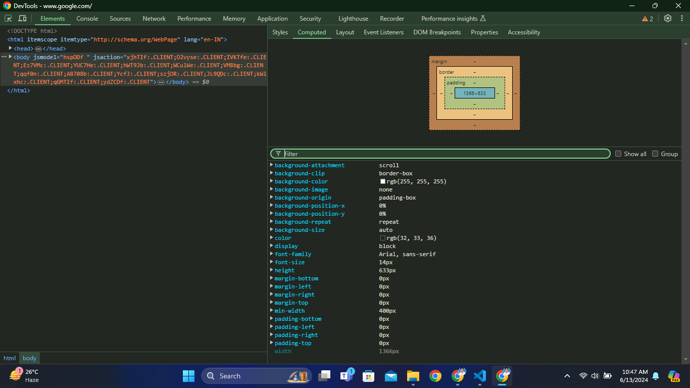
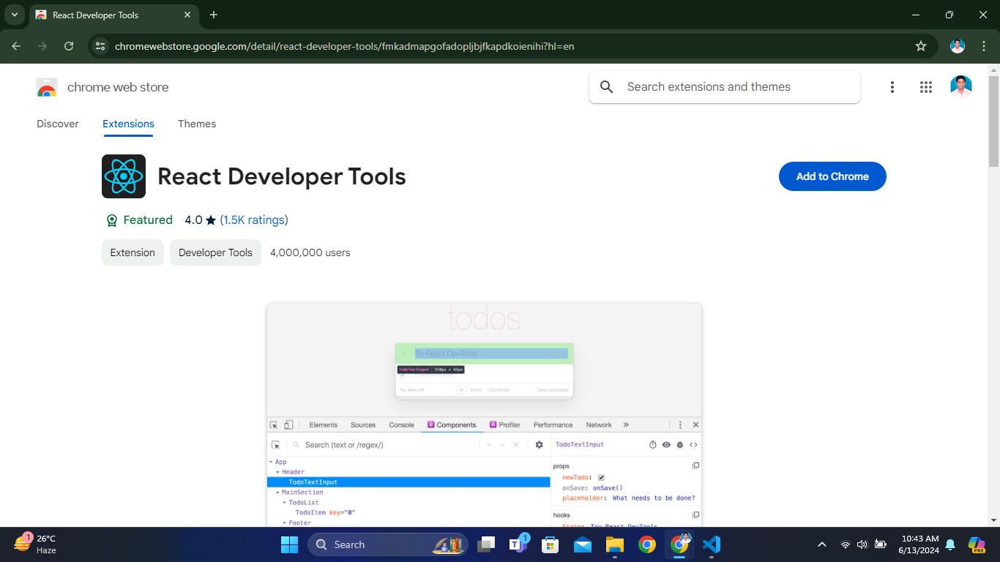
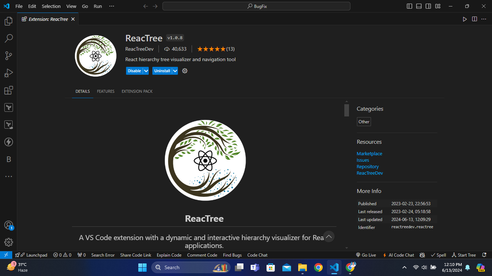

# React Debugging

Index

## Index
* Tools
* Find UI code in codebase

---

Tools

## Tools
1. Browser Developer Tools
2. React Developer Tools
3. Reactree VScode Extension

### Browser Developer Tools

### React Developer Tools
* React Developer Tools is an extension available for Chrome and Firefox that allows you to inspect the React component hierarchy in the browser's Developer Tools.

### Reactree
It gives the Complete DOM

---

Find UI code in codebase

## Find UI code in codebase

1. Understand the Project Structure

src/
|--- Pages/
|    |--- Home/
|    |--- About/
|    |--- NotFound/
|--- Layouts/
|    |--- Header/

2. Use the Browser Developer Tools
   * Inspect Element: Open your application in a web browser and use the "Inspect" tool (right-click on the UI element and select "Inspect").
   * Identify Component Name: In the Elements panel, look for React-specific attributes like `data-reactroot`, `data-reactid`, or `classes` and `ids` that might give hints about the component's name or structure.

3. React Developer Tools
* It allows you to inspect the React component tree directly and see the component hierarchy and props.
* You can check particular Component State and Props.
* we can use the Profiler to record the time it took each component to be rendered. In order to do so, we need to click the Start profiling or Reload and start profiling buttons.
 

4. Search the Codebase
* Use a text editor or IDE with search functionality (like VS Code, WebStorm, or Sublime Text) to search the codebase:   
* Search by ClassName/ID: Search for unique class names or IDs that you identified using the browser's Developer Tools.
* Search by Component Name: If you have an idea of the component name, search for the component definition (e.g., function ComponentName or class ComponentName).
* Search by Text: If the component renders specific text, you can search for that text string in the codebase.

5. Trace from Entry Points
* Start from App.js: Look at App.js or the main entry point of your application to see how components are structured and routed.
* Check Routing Configuration: If your project uses a router (like react-router), check the routing configuration to understand how different pages and components are connected.

6. Understand Component Hierarchy
* Component Files: Open and understand the main component files. Look for import statements to see which components are being used.
* Parent-Child Relationships: Identify parent-child relationships to understand how components are nested.

7. Leverage Code Comments and Documentation
Check for any comments in the code or project documentation that might help you understand the component structure and functionality.

### Example Workflow
* Identify the Element: Suppose you need to change a button in the header. Use the browser's Developer Tools to inspect the button element.
* Locate the Component: Note any unique identifiers (e.g., class names). Use your text editor to search for these identifiers in the src/components/Header directory.
* Trace Imports: Find the component file, then trace back to see how it’s imported and used in the project.
Make the Change: Once you’ve located the correct component, make the necessary UI changes.
* use __debugger__ keyword to find problem in step by step.

---

Reading Material

## Reading Material
* https://dev.to/colocodes/how-to-debug-a-react-app-51l4

---

